# Kurs: Examensarbete - Frontend Development

## Utbildning till Frontend Developer på Medieinstitutet

Detta är mitt examensarbete - ett webbaserad planeringsverktyg för hobbyodlare. Projektet är byggt med React, TypeScript och SCSS.

Skapad av **Marie Lenvik** <br> https://github.com/M-Lenvik

## Innehållsförteckning

1. [Beskrivning av projektet](#-beskrivning-av-projektet--såsmart)
2. [Kom igång med projektet](#kom-igång-med-projektet)
   1. [Installera genom följande](#installera-genom-följande)
3. [Tekniker som använts](#tekniker-som-använts)
4. [Projektbeskrivning](#projektbeskrivning)
   1. [Syfte och målgrupp](#syfte-och-målgrupp)
   2. [Personas och användarscenarier](#personas-och-användarscenarier)
   3. [Funktionalitet](#funktionalitet)
   4. [Arkitektur](#arkitektur)
5. [Projektplanering och tidsplan](#projektplanering-och-tidsplan)
6. [Testning](#testning)
   1. [Användbarhetstester](#användbarhetstester)
   2. [Lighthouse-analys](#lighthouse-analys)
7. [Tillgänglighet](#tillgänglighet)
8. [Bilder](#bilder)
9. [Projektplanering och tidsplan](#projektplanering-och-tidsplan)
10. [Tekniska val och begränsningar](#tekniska-val-och-begränsningar)
11. [Projektets styrkor och reflektioner](#projektets-styrkor-och-reflektioner)
12. [Betygskriterier](#betygskriterier)
13. [Slutbetyg](#-slutbetyg)

## 🔍 Beskrivning av projektet 📚 SåSmart

SåSmart är en webbaserad planeringsverktyg designad för svenska hobbyodlare som vill ha ett tydligare och mer strukturerat sätt att planera sin odlingssäsong. Användare väljer plantor från en digital fröbank, anger ett önskat skördedatum, och applikationen beräknar automatiskt alla relaterade datum i odlingsprocessen, inklusive inomhus sådd, utomhus sådd, avhärdning, utplantering och skörd. Dessa datum presenteras i en kalendervy som visuellt guidar användaren genom hela odlingstidslinjen.

Genom att lagra plantinformation digitalt och koppla den till användarens plan tar applikationen bort behovet av att förlita sig på fysiska fröpåsar. Fokus ligger på att förenkla planering, centralisera information och automatisera tidskrävande beräkningar till en tydlig, användarvänlig flöde.

## Kom igång med projektet

**🛠️ Installera genom följande:**

1. **Kloning av projektet**
   - `git clone [repo-url]`
   - `cd SowSmart`

2. **Installera alla beroenden**
   Projektet är ett Vite-projekt. Kör följande kommando för att installera alla nödvändiga paket enligt package.json:

```shell
npm install
```

3. **Starta localhost**
   Projektet kör nu lokalt på localhost:5173 (eller annan port om 5173 är upptagen). Navigera till projektets rotmapp och kör:

```shell
npm run dev
```

💡 **Tips:** Se till att du har Node.js och npm installerat innan du börjar.

4. **Bygga för produktion**
   För att bygga projektet för produktion:

```shell
npm run build
```

5. **Förhandsgranska produktionsbygg**
   För att förhandsgranska produktionsversionen:

```shell
npm run preview
```

## 💻 Teknikstack

```
┌─────────────────────────────────────────────────┐
│        🌱 SåSmart Tech Stack 🌱                │
├─────────────────────────────────────────────────┤
│                                                 │
│   ⚛️  React 19  │  📘 TypeScript  │  ⚡ Vite   │
│                                                 │
│  🎨 SCSS/Sass  │  🗺️  React Router  │  📱 PWA  │
│                                                 │
│  💾 localStorage  │  🚀 GitHub Pages           │
│                                                 │
└─────────────────────────────────────────────────┘
```

 <br>
 <br>
 <br>
 <br>
 <br>
 <br>
 <br>


**Tekniska val och motiveringar:**

**React:** Valdes för dess komponentbaserade arkitektur med funktionella komponenter och hooks, vilket uppmuntrar återanvändbar kod och tydlig separation of concerns. React 19 används med funktionella komponenter och hooks för state management.

**TypeScript:** Lägger till kompileringstid-typsäkerhet, fångar fel under utveckling snarare än i produktion och förbättrar utvecklarupplevelsen. Alla komponenter, helpers och services är fullt typade.

**Vite:** Fungerar som byggverktyg och utvecklingsserver, erbjuder betydligt snabbare start och hot module replacement jämfört med äldre bundlers. Konfigurerad för React med TypeScript.

**SCSS (Sass):** Används för styling med variabler, mixins, nesting och en BEM-inspirerad namngivningskonvention. CSS-anpassade egenskaper används också för dynamisk styling. Designen följer en mobile-first responsiv approach med breakpoints vid 425px, 768px, 1024px och 1440px.

**React Router:** Client-side routing hanteras med createHashRouter, vilket är nödvändigt för korrekt routing på GitHub Pages statisk hosting, vilket möjliggör en flersidig upplevelse inom en single-page application-arkitektur.

**Context API + useReducer:** State management förlitar sig på Reacts Context API med en dedikerad planReducer. Detta tillvägagångssätt ger en tydlig och skalbar statestruktur, håller arkitekturen enkel och lämplig för projektets omfattning.

**localStorage:** Användarplaner sparas lokalt med localStorage, vilket undviker behovet av backend-infrastruktur samtidigt som data förblir sparad mellan sessioner på samma enhet och webbläsare.

**PWA (Progressive Web App):** Implementerad med vite-plugin-pwa för offline-användning och installerbart beteende. Manifest konfigurerad med appens namn, ikoner, temafärg och start-URL.

**Självhostade typsnitt:** Typsnitt är självhostade via @fontsource (@fontsource/combo, @fontsource/noto-sans, @fontsource/sour-gummy) för att förbättra prestanda och tillförlitlighet, eliminera render-blocking från tredjepartsfontkällor.

**GitHub Pages:** Deployment hanteras via GitHub Pages för statisk hosting, med GitHub Actions som automatiserar deployment vid pushes till main branch.

**Plantdata:**
Plantdata lagras i en JSON-fil (`src/data/plants.json`) som skapas från information hämtad från Impecta frökatalog (https://www.impecta.se). Information om plantor, sådfönster, skördefönster och odlingsinstruktioner samlas in från Impectas webbplats och kompletteras med information från svenska odlingsresurser som odla.nu.

**Default-värden:**
Default-värden för plantegenskaper (sådmetod, avhärdningsdagar, frosttolerans, grotid, temperaturer, dagar inomhus tillväxt) baseras på odlingskunskap från odla.nu och trädgårdsexpertis, organiserade per subcategory (t.ex. "tomat", "gurka", "ärter").

**Tekniska referenser:**
- React 19 dokumentation
- TypeScript dokumentation
- Vite dokumentation
- React Router dokumentation (createHashRouter för GitHub Pages)
- SCSS/Sass dokumentation
- WCAG 2.1 AA riktlinjer
- Lighthouse dokumentation

## Projektbeskrivning

### Syfte och målgrupp

Projektet härstammar från personlig erfarenhet som hobbyodlare som kämpade med att hålla koll på sådd- och skördeinformation när den är spridd över fröpåsar, anteckningar och olika webbplatser. Viktiga instruktioner och plantspecifik information som lagras på fysiska fröpåsar går lätt förlorad över tid, vilket gör det svårt att referera till dem under odlingssäsongen.

Traditionella kalenderpåminnelser hjälper till att spåra datum men saknar förmågan att beräkna relaterade sådd- och förberedelsedatum baserat på ett önskat skördetidpunkt. Detta kräver ofta manuella beräkningar och upprepad forskning.

SåSmart adresserar dessa problem genom att centralisera plantinformation digitalt och automatisera beräkningen av alla relevanta datum baserat på ett användardefinierat skördedatum. När en användare väljer en planta lagras dess associerade information och kopplas till planen, vilket tar bort behovet av att förlita sig på fysiska fröpåsar. Applikationen genererar sedan kalenderhändelser som visuellt guidar användaren genom odlingsprocessen, med klickbara förklaringar för varje steg.

För att hålla projektet inom en realistisk omfattning fokuserar MVP:n på tydlighet, användbarhet och att hjälpa användare att behålla en översikt över sin odlingsplan genom automatisering och strukturerad information baserat på specifika skördedatum.

**Målgrupp:**
Den primära målgruppen består av hobbyodlare, nybörjare och stadsodlare som vill ha ett enkelt och strukturerat sätt att planera sin odlingssäsong utan att behöva avancerad trädgårdskunskap.

Dessa användare känner sig ofta osäkra på när de ska så, plantera om och skörda, och de vill undvika tidskrävande manuella beräkningar och sökning genom fröpåsar och webbplatser för information. De värdesätter att ha all plantrelaterad information samlad på ett digitalt ställe och uppskattar tydlig visuell vägledning som hjälper dem att förstå odlingsprocessen steg för steg.

Stadsodlare med begränsat utrymme, såsom balkonger, små trädgårdar eller kollektivträdgårdar, är en viktig segment, eftersom varje planteringsbeslut spelar roll när utrymmet är begränsat. De drar nytta av ett verktyg som hjälper dem att planera effektivt och få ut det mesta av sitt odlingsområde.

Applikationen är designad med mobilanvändning i åtanke, vilket gör det möjligt för användare att komma åt sin plan direkt i trädgården eller medan de köper frön. Responsiv design säkerställer att verktyget fungerar bra på alla skärmstorlekar, från mobila enheter till stationära datorer.

### Personas och användarscenarier

Tre detaljerade personas skapades i början av projektet för att vägleda utvecklingsprocessen:

**Persona 1: Anna - Den Erfarna Hobbyodlaren**
Anna är 45 år gammal och har odlat grönsaker i sin 150 kvadratmeter stora trädgård i Stockholm under de senaste 12 åren. Hon arbetar heltid som lärare men ägnar sina kvällar och helger under odlingssäsongen åt sin trädgård, som har blivit hennes primära form av avkoppling och stresslindring. Annas huvudutmaning är inte brist på kunskap—hon känner sina plantor väl—utan snarare organisation och optimering, eftersom hon över åren har samlat en samling fröpåsar, handskrivna anteckningar och bokmärkesmappar fulla av webbplatser, men denna information är spridd och svår att referera till när den behövs.

**Persona 2: Marcus - Stadsodlaren Nybörjaren**
Marcus är 28 år gammal och bor i en tvåa i Gävle med en liten balkong som får bra solljus i cirka sex timmar per dag. Han arbetar inom IT och spenderar största delen av sin tid inomhus men har blivit alltmer intresserad av hållbarhet och självförsörjning under det senaste året. Marcus har noll odlingserfarenhet, har aldrig hört talas om "avhärdning" och är lätt överväldigad av mängden motstridig information online.

**Persona 3: Sara - Den Erfarna Experimenteraren**
Sara är 52 år gammal och har odlat grönsaker i över 20 år i sin stora trädgård i Östersund. Hon arbetar som gymnasielärare i biologi och ser sin trädgård som både en hobby och ett praktiskt laboratorium för att testa odlingstekniker i ett utmanande nordligt klimat. Saras tillvägagångssätt är metodiskt och datadrivet—hon håller detaljerade anteckningsböcker över planteringsdatum, väderförhållanden och skörderesultat från tidigare år.

Dessa personas påverkade kärndesignbeslut och funktionalitet som levererades: Anna betonade behovet av bättre organisation och planeringsstöd, vilket informerade skapandet av fröbanken, sparad plantdata och kalenderöversikt. Marcus betonade vikten av tydlighet och vägledning för nybörjare, vilket ledde till detaljerade plantinformationskort, validering av planteringsdatum och användarvänliga rekommendationer. Sara fokuserade på tillförlitlighet och korrekta beräkningar, vilket formade appens betoning på sådfönster, skördefönster och skördeplanering.

### Funktionalitet

**Steg 1: Introduktion och navigering**
Användare börjar på startsidan där syftet med applikationen presenteras. Härifrån navigerar de till fröbanken.

**Steg 2: Fröval**
I fröbanken bläddrar användare i en sökbar och filtrerbar lista över plantor organiserade i kategorier. Användare väljer plantor för sin plan med kryssrutor. Varje planta kan klickas för att öppna en modal som visar detaljerad information såsom sådfönster, skördefönster och odlingsinstruktioner.

**Steg 3: Skördeplanering och validering**
Efter att ha valt plantor går användare vidare till planeraren där de sätter ett skördedatum. Systemet validerar omedelbart detta datum mot varje plantas egenskaper och visar varningar om datumet är för nära, i det förflutna eller utanför det rekommenderade skördefönstret. Användare kan också sätta individuella skördedatum per planta direkt i listan.

**Steg 4: Automatisk datumberäkning och kalendervisualisering**
Systemet beräknar automatiskt viktiga datum för varje planta—såsom inomhus sådd, utomhus sådd, avhärdning, utplantering och skörd—baserat på dess specifika tillväxtintervall och odlingsmetod. Dessa beräknade händelser presenteras först som en strukturerad lista i planeringsvyn. Användare kan sedan växla till kalendervyn, där alla händelser visas visuellt på en månadskalender. Dagar med aktiviteter markeras med ikoner, och vid hovring över dem visas detaljerad information om plantorna och uppgifterna.

**Steg 5: Min frösida**
Användare kan navigera till "Min frösida" där hela planen sammanfattas. Här kan användare se en konsoliderad översikt över alla kommande händelser. Planen sparas i lokal lagring för framtida besök.

**Ytterligare stöd**
Användare har också tillgång till en odlingsråd-sida med förklaringar och praktiska råd för att stödja förståelsen av odlingsprocessen.

### Arkitektur

Applikationen följer en tydlig separation of concerns med fyra huvudlager:

**Services (src/services/)**
Ansvarar för att läsa plantdata från plants.json, normalisera den och tillhandahålla säkra fallback-värden. `plantsService.ts` läser rå plantdata från JSON-filen, validerar strukturen och normaliserar den till en stabil `Plant`-typ som används genom hela applikationen.

**Helpers (src/helpers/)**
Organiserade efter ansvar:
- `date/` – datumhantering och formatering (lägg till/subtrahera dagar, formatera/parsa ISO-datum, svenska datumformat)
- `plant/` – plantrelaterade standardvärden och logik (default-värden per subcategory, normalisering av plantdata)
- `calculation/` – genererar odlingsrekommendationer (beräknar sådatum, avhärdning, utplantering baserat på skördedatum)
- `calendar/` – konverterar rekommendationer till kalenderhändelser och uppgiftslistor
- `storage/` – localStorage-persistens: sparar/laddar planstatus och filterbaserade skördedatum
- `utils/` – generiska verktyg (sortering, bildhantering med fallback, capitalizeFirst)
- `validation/` – validerar datum mot plantbegränsningar (sådfönster, skördefönster, varningar)

**Global State – Context + Reducer (src/context/, src/reducers/)**
All planeringsstatus hanteras genom PlanContext och planReducer.
- Åtgärder uppdaterar status oföränderligt
- Varje statusändring sparas automatiskt till localStorage
- Sparad status återställs vid appladdning
- Plan state innehåller: valda plant-ID:n, globalt skördedatum, individuella skördedatum per planta, genererade rekommendationer

**Components och Pages (src/components/, src/pages/)**
- Pages är routade vyer som komponerar komponenter
- Components är återanvändbara eller sidspecifika byggstenar
- Varje komponent har sin egen .tsx och .scss
- Komponenter är organiserade i feature-baserad struktur: `calendar/`, `plantSelection/`, `planner/`, `myGarden/`, `shared/`, etc.

**Applikationswrapper-struktur:**
```
PlanProvider → Router → Layout → Pages
```

Layout innehåller:
- Header och navigation
- Scroll helpers (scroll to top/bottom)
- Toast system
- `<Outlet />` för routade sidor

**Huvudsidor:**
- Home – Introduktion och navigering
- Plant Selection – Fröbank med sök, filter och modal med plantdetaljer
- Harvest Planner – Datuminput, validering, per-planta datum, beräkna rekommendationer
- Calendar View – Visuell händelsekalender med ikoner och filter
- My Garden – Fullständig planöversikt och uppgiftslista
- About – Om applikationen
- Growing Tips – Förklaringar och praktiska råd

**Dataflöde i applikationen:**
1. Pages hämtar plantdata via plantsService
2. Pages läser och uppdaterar global state via PlanContext
3. Användaråtgärder dispatchar reducer-åtgärder
4. Reducer uppdaterar state och skriver till localStorage
5. Stateändringar triggar omrendering där det behövs
6. Rekommendationer genereras via helper-beräkningsfunktioner
7. Custom hooks kapslar in återanvändbar logik (t.ex. toast-meddelanden när plantor läggs till/tas bort)

**Datamodell:**
- **Plant-modell** innehåller: plantmetadata, tillväxtvaraktigheter, sådfönster, skördefönster, metod (inomhus/utomhus/båda)
- **Plan state** innehåller: valda plant-ID:n, globalt skördedatum, individuella skördedatum per planta, genererade rekommendationer

**Styling-struktur:**
Varje komponent har sin egen SCSS-fil. Globala stilar hanteras genom partials för:
- Reset och basstilar
- Brytpunkter och mixins (425px, 768px, 1024px, 1440px)
- Färgvariabler och tema
- Huvudstilmall

Designen följer en mobile-first responsiv approach med breakpoints vid 425px, 768px, 1024px och 1440px.

## Testning

### Användbarhetstester

Jag genomförde användbarhetstester med Think Aloud-metoden. Testdeltagare fick först en kort introduktion till projektet och dess syfte, följt av en uppsättning specifika uppgifter att slutföra. Under uppgifterna uppmuntrades deltagarna att verbalisera sina tankar medan jag observerade deras interaktioner och beteenden.

**Testdeltagare:**
På grund av svårigheter att rekrytera användare som matchade personas arbetade jag med deltagare som hade måttlig odlingskunskap men relativt hög teknisk kompetens.

**Testscenarier:**
- **Test A:** Hitta information om tomatvarieteten "Goldwin"
- **Test B:** Skapa en odlingsplan för flera sorter med specifika skördedatum (inklusive korrigering av ett ogiltigt datum)
- **Test C:** Förklara vilka aktiviteter som är schemalagda i kalendervyn och när
- **Test D:** Navigera till "Min frösida", återkalla valda sorter och svara på frågor om sådd- och avhärdningsscheman
- **Test E:** Ge feedback på tydligheten och användbarheten av odlingsrekommendationer

**Detaljerad sammanfattning av resultat och förbättringar:**

**Test A:**
- Två användare hade problem med att hitta sökfältet och förstå subkategorier.
- **Förbättring:** Flyttade fritextsökningen ovanför kategorier för att öka synligheten av plantsorter.
- En användare på iPhone kunde inte se stängningsknappen ("X") på modalen.
- **Förbättring:** Justerade modalstorlek och responsivitet för mindre skärmar.

**Test B:**
- En användare kämpade med att välja plantor på grund av små kryssrutemål.
- **Förbättring:** Ökade kryssrutornas klickområde.
- En användare råkade kassera valda plantor.
- **Förbättring:** Lade till bekräftelsedialog för borttagningar och tydligare "X"-knapptext.
- Dropdowns var generellt frustrerande, och en användare glömde att avmarkera en planta.
- **Förbättring:** Dropdown rensas automatiskt efter bekräftelse av datumval; lade till bekräftelseknapp för datumval som triggar rensning.
- Två användare hade svårt att sätta skördedatum.
- **Förbättring:** Lade till en "Ändra datum"-knapp som öppnar en kalender för valda plantor.
- En användare oroade sig för att bakåtpilen i subkategorier skulle rensa val.
- **Förbättring:** Lade till bekräftelsetoast-meddelanden och behöll kategorival efter navigering tillbaka.
- En användare glömde vilken planta som var vald för datuminställning på grund av dropdown-visningsproblem.
- **Förbättring:** Förenklade dropdown-visning för att undvika att visa flera val när endast ett är aktivt.

**Test C:**
- Två användare tyckte att navigationspilar var otydliga.
- **Förbättring:** Omdesignade pilar för att vara skarpare och mer distinkta.
- En användare noterade att tooltips ibland var delvis dolda.
- **Förbättring:** Justerade tooltip-positionering för att förhindra klippning.

**Test D:**
- Två användare använde inte sammanfattningen för att kontrollera aktiviteter för 1 maj.
- **Förbättring:** Auto-expandera alla valda plantor vid navigering till sidan; på desktop, visa sammanfattningar sida vid sida.
- Två användare förstod inte instruktioner om "avhärdning" eller hade problem med att skilja mellan inomhus- och utomhussådd.
- **Förbättring:** Lade till detaljerad vägledning om odlingsmetoder och tydligt märkta "Inomhus sådd" och "Utomhus sådd".

**Test E:**
- En användare missade information om vad man ska göra under vissa händelser (t.ex. avhärdning).
- **Förbättring:** Gjorde händelseikoner klickbara med förklarande tooltips.

**Ytterligare feedback och önskemål:**
- En användare tyckte att länken till startsidan var otydlig.
- **Förbättring:** Ändrade etikett till "Tillbaka till SåSmart".
- Användare uttryckte intresse för en informationssida som täcker:
  - Vad är avhärdning och hur gör man det
  - Vad betyder utplantering
  - Hur man sår frön och jordrekommendationer
  - Skillnader mellan inomhus- och utomhussådd
  - Föreslog att göra dessa ämnen klickbara på startsidan.
- Begärde mer detaljerad information om sorter, inklusive smak och andra egenskaper.

Denna användbarhetstestningsfas gav värdefulla insikter som vägledde praktiska förbättringar av gränssnittet, arbetsflödet och instruktionsinnehållet, vilket hjälpte till att bättre anpassa applikationen till användarnas behov och förväntningar.

### Lighthouse-analys

Under projektets slut genomfördes en Lighthouse-revision för att bedöma applikationens prestanda, tillgänglighet, SEO och bästa praxis. Baserat på revisionsresultaten implementerades flera optimeringar för att förbättra den övergripande kvaliteten och användarupplevelsen.

**Bildoptimering:**
- Stora PNG-bilder konverterades till WebP-format
- Lossless-optimering applicerades på PWA-ikoner
- CSS-bakgrundsbilder ersattes med ``-taggar
- Explicit width och height-attribut lades till för alla bilder
- Lazy loading implementerades för bilder under fold

**Fontoptimering:**
- Flyttade från externt länkade Google Fonts till självhostade typsnitt via @fontsource
- Endast nödvändiga fontvikter importerades
- Eliminerade render-blocking från tredjepartsfontkällor

**PWA-funktionalitet:**
- Manifest konfigurerades korrekt med appens namn, ikoner, temafärg och start-URL
- Service worker lades till med inline-registrering
- Navigationsfallback konfigurerades för SPA-routing på GitHub Pages

**SEO-förbättringar:**
- Canonical-länk inkluderades
- Meta-beskrivning och nyckelord uppdaterades (på svenska)
- Open Graph-taggar lades till
- Twitter Card-taggar implementerades
- Robots meta-tagg lades till

**Tillgänglighet:**
- Färgkontrastförhållanden förbättrades för att möta WCAG AA-standarden
- Alla ikonknappar fick lämpliga aria-label-attribut
- Dekorativa ikoner markerades med aria-hidden="true"
- Kollapsbara sektioner utrustades med aria-expanded-attribut
- Korrekt rubrikhierarki (h1 till h3) upprätthölls

## Tillgänglighet

Tillgänglighet har varit ett kontinuerligt fokus genom hela projektet, med betoning på semantisk HTML, tydlig struktur, god kontrast och full tangentbordsanvändbarhet i linje med WCAG AA-standarden.

**Semantisk HTML:**
Applikationen är byggd med semantiska HTML-element som `<header>`, `<nav>`, `<main>`, `<section>` och `<article>` för att säkerställa en tydlig och förståelig struktur för användare och hjälptechnologier. Korrekt rubrikhierarki (h1 till h3) upprätthålls på alla sidor, och listor används semantiskt där det är lämpligt. Bilder använder ``-taggar med meningsfull alt-text snarare än CSS-bakgrundsbilder, vilket förbättrar förståelsen för skärmläsare.

**ARIA-attribut:**
Där semantisk HTML inte räcker har ARIA-attribut lagts till för att förtydliga funktionalitet. Till exempel inkluderar alla ikonknappar aria-labels, dekorativa ikoner är markerade med aria-hidden="true", kollapsbara sektioner har aria-expanded-attribut, och inputs är associerade med förklarande text via aria-describedby. Modaler har aria-modal="true" och korrekt aria-label för tydlighet.

**Färg och kontrast:**
Färg och kontrast har hanterats noggrant för att möta WCAG AA-krav. Färgkombinationer kontrollerades regelbundet med kontrastverktyg, designjusteringar gjordes för att förbättra synligheten (inklusive justeringar av primärgrön för högre kontrast), alla interaktiva element har tydliga fokusindikatorer, och beröringsmål möter rekommenderade storlekar för mobila enheter (minst 44x44px).

**Tangentbordsnavigering:**
Applikationen stödjer komplett tangentbordsnavigering: alla interaktiva element är nåbara via tabbning i logisk ordning, synliga fokusindikatorer guidar användaren, modaler kan stängas med ESC-tangenten, och knappar och kontroller svarar på Enter- och Space-tangenter. Filterdropdown stödjer pil upp/ned för navigering mellan alternativ, Tab stänger dropdown, och Home/End navigerar till första/sista alternativet.

**Formulär:**
Formulär är designade med tydlighet i åtanke, med synliga, associerade etiketter för alla inputs och logisk läsordning. Ytterligare förklaringar tillhandahålls med aria-describedby där det behövs. Felmeddelanden och varningar är kopplade till inputs via aria-describedby.

**Bilder:**
Bilder är optimerade både för tillgänglighet och prestanda, med alt-text på informativa bilder, lazy loading aktiverat, explicit width och height för att förhindra layoutskift, och fallback-hantering via error-händelser som ersätter trasiga bilder med en genererad SVG-fallback.

**Verifiering:**
Tillgänglighet verifierades genom automatiserade Lighthouse-revisioner, manuella färgkontrastkontroller under designprocessen, noggrann praktisk tangentbordsnavigeringstestning över applikationen och användbarhetstester med think-aloud-metoden med riktiga användare.

## Bilder

<details>
<summary><strong>Skärmdumpar från webbplatsen</strong></summary>

**Startsida**
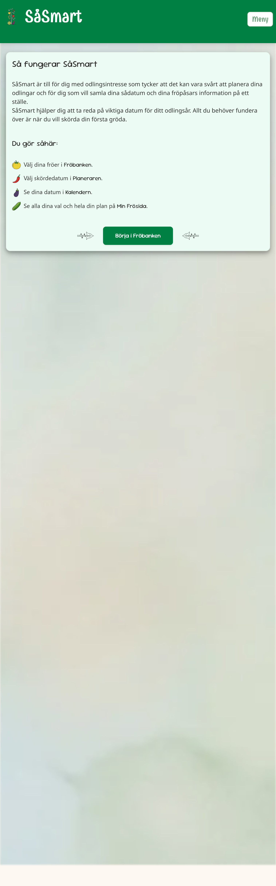

**Fröbanken - översikt**
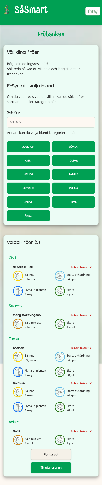

**Fröbanken - kategorival**
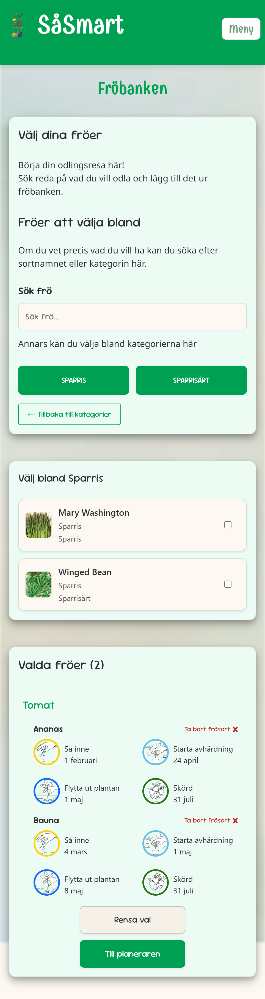

**Fröbanken - plantdetaljer modal**
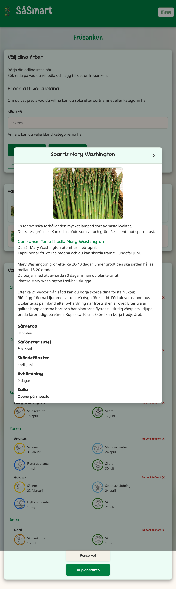

**Planeraren**
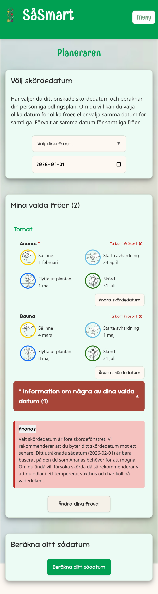

**Kalendervy**
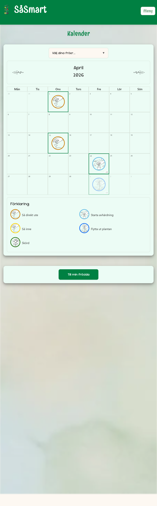

**Min frösida**
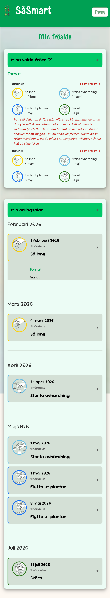

**Odlingsråd**
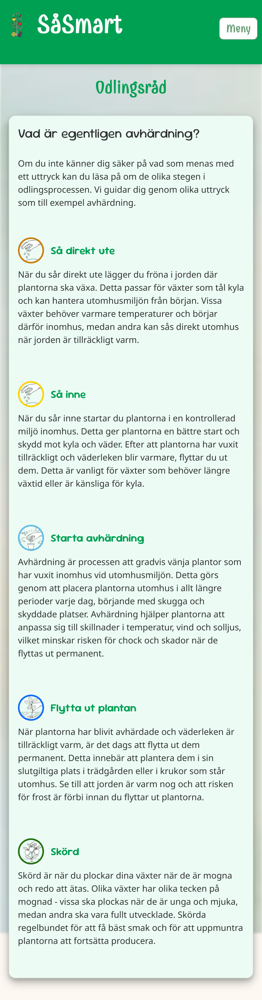

**Om SåSmart**
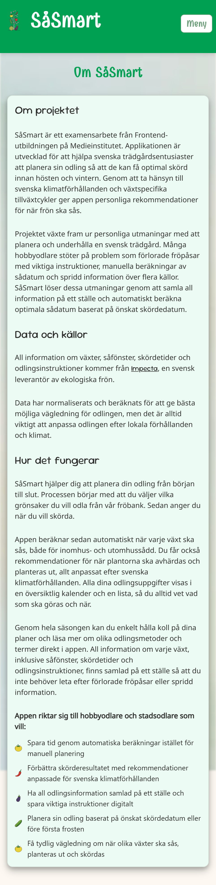
</details>

<details>
<summary><strong>Lighthouse-analys</strong></summary>

**Lighthouse-analys desktop**
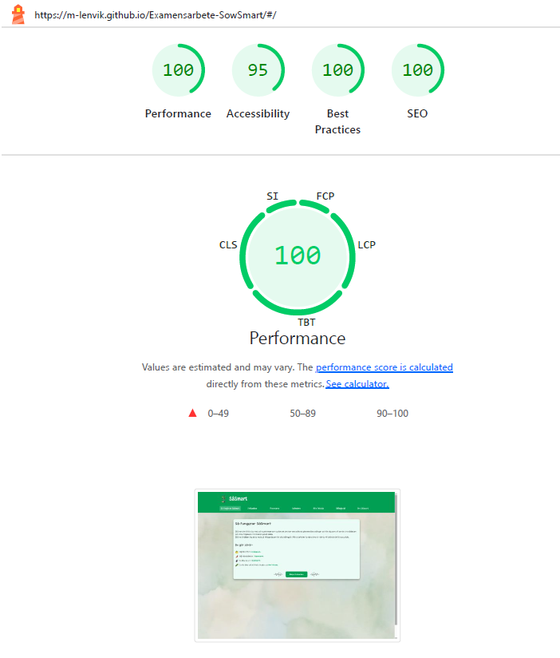

**Lighthouse-analys mobile**
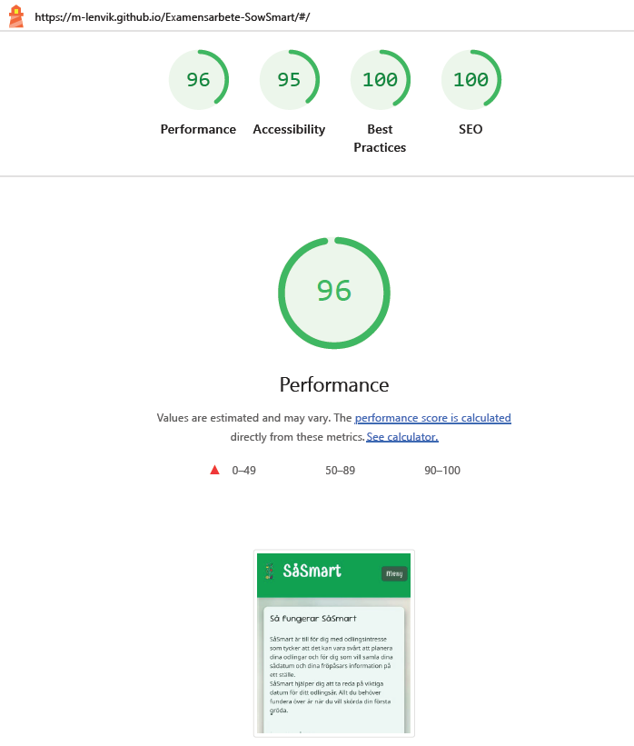
</details>

## Projektplanering och tidsplan

Arbetet följde sprintplanen som beskrivs i projektbeskrivningen men justerades kontinuerligt baserat på användbarhetstester och tekniska prioriteringar.

**Sprint 1:**
Sprint 1 fokuserade på kärnstrukturen och fröbanken. Alla fyra uppgifter slutfördes: mockup, projektsetup & konfiguration, plantval och baskomponenter.

**Sprint 2:**
Sprint 2 prioriterade beräkningslogik och kalenderflöde. Kärnlogiken och algoritmen för planteringsberäkningar implementerades, tillsammans med kalendervyn och localStorage-integration.

**Sprint 3:**
Sprint 3 planerades för polering, användbarhetstester och deployment. Betydande framsteg gjordes på responsiv design och användartester. Responsiv design utvecklades kontinuerligt med en mobile-first approach. Användbarhetstester genomfördes med tre användare, och deployment till GitHub Pages slutfördes.

**Avvikelser från planen:**
Responsiv design arbetades på kontinuerligt snarare än som en separat sprintuppgift, och prestandaoptimering lades till utöver den ursprungliga planen efter att en Lighthouse-analys avslöjade prestandaproblem.

## Tekniska val och begränsningar

### Scope-begränsningar

Detta projekt fokuserade på att leverera kärnfunktionalitet inom den tillgängliga tidsramen och resurserna. Följande begränsningar finns:

**Plantdata:**
Plantdata är statisk och inbäddad i en JSON-fil, vilket begränsar uppdateringar och användaranpassningsalternativ. Detta beror på att jag inte kunde etablera ett samarbete med någon av de svenska fröleverantörerna, trots många försök. Dessa begränsningar kan påverka skalbarhet och användarflexibilitet men tillät projektet att koncentrera sig på användbarhet och kärnplaneringsfunktioner. Framtida iterationer kunde adressera dessa begränsningar genom att integrera dynamiska datakällor och backend-stöd.

**Utvecklingsprocess:**
Responsiv design och prestandaoptimering blev pågående ansträngningar genom utvecklingen, vilket ledde till vissa förändringar i tidslinjen och fokus jämfört med de initiala sprintplanerna. Användbarhetstester med riktiga användare påverkade också prioriteringar och ledde till förbättringar som inte ursprungligen planerades i detalj.

Projektet levererade en fullt fungerande och användbar MVP som möter kärnmålen: förenkla trädgårdsplanering, tillhandahålla automatiska beräkningar baserat på specifika skördedatum och erbjuda en tydlig visuell översikt genom kalenderfunktionen.

## Projektets styrkor och reflektioner

📌 **Projektets styrkor:**
- Fullt fungerande MVP med kärnfunktionalitet implementerad
- Tydlig separation of concerns med välstrukturerad kod
- Omfattande användbarhetstester som ledde till konkreta förbättringar
- God tillgänglighet med WCAG AA-standarden i åtanke
- Responsiv design med mobile-first-tillvägagångssätt
- PWA-funktionalitet för offline-användning
- Omfattande dokumentation av kod och arkitektur
- Kontinuerlig prestandaoptimering baserat på Lighthouse-analys
- Feature-baserad komponentstruktur som gör koden lätt att navigera

💡 **Personliga reflektioner och lärdomar:**

Genom hela projektet fick jag värdefulla insikter i både utveckling och projektledning. En av de viktigaste lärdomarna var värdet av användbarhetstester och att observera användare i praktiken. Att bara se hur användare interagerade med applikationen var extremt insiktsfullt och ledde till många förbättringar som jag inte skulle ha identifierat på egen hand. Till exempel avslöjade testerna att användare hade svårt att hitta sökfältet, tyckte att dropdown-menyer var förvirrande och behövde tydligare förklaringar av vissa begrepp som avhärdning.

En annan viktig lärdom var att inse att uppgifter konsekvent tar längre tid än initialt förväntat. Detta gäller inte bara kodning, utan också planering, testning och refaktorering. Att ha en realistisk tidsplan och tillåta buffertid är avgörande för att leverera kvalitetsarbete.

När det gäller komponentstruktur lärde jag mig vikten av att använda komponenter för återanvändbarhet, samtidigt som jag också erkände hur snabbt detta kan bli komplext och svårt att hantera. Det blev tydligt att förstå hur man strukturerar komponenter effektivt kräver erfarenhet som vinns från flera projekt. Ett konkret exempel var hur händelseikoner hanterades i projektet, där strukturen blev något oorganiserad. Efteråt kunde detta ha planerats mer effektivt från början. Detta belyste vikten av kontinuerlig refaktorering och att tänka noggrant på arkitektur tidigt, samtidigt som man accepterar att lära sig och förbättra struktur iterativt är en naturlig del av utvecklingsprocessen.

En annan viktig lärdom gällde användningen av custom hooks. Under projektet introducerades hooks som usePlantSelectionToasts senare i utvecklingen för att kapsla in återanvändbar logik för toast-meddelanden. Detta visade vikten av att kontinuerligt identifiera mönster som kan extraheras till hooks, även om detta inte planerades från början. Custom hooks visade sig vara ett kraftfullt sätt att göra kodbasen mer modulär och underhållbar.

En särskilt slående insikt var hur kod som kändes helt förståelig när den skrevs kunde bli svår att tolka bara några dagar senare. Detta var särskilt sant för komplex logik som datumberäkningar och validering. Som ett resultat lärde jag mig vikten av att kommentera och dokumentera kod, särskilt där logiken inte är omedelbart uppenbar. JSDoc-kommentarer och tydlig variabelnamngivning förbättrade betydligt kodens underhållbarhet.

Ytterligare reflektioner om projektet inkluderar vikten av att etablera en tydlig kodstruktur från början. Att följa etablerade mönster som separation of concerns (services, helpers, components) gjorde det mycket enklare att navigera kodbasen och lokalisera funktionalitet. En konkret förbättring var att organisera komponenter med en feature-baserad struktur, där komponenter grupperas efter funktionalitet eller efter vilken sida de tillhör. Till exempel placeras alla kalenderrelaterade komponenter i calendar/, alla plantval-komponenter i plantSelection/, och delade komponenter i shared/. Detta är betydligt enklare att navigera än den tidigare strukturen där alla komponenter fanns i samma katalog.

Mobile-first-approach var också viktig—att börja med mobila layouter och sedan expandera till större skärmar säkerställde att applikationen fungerar bra på alla enheter.

Slutligen lärde jag mig vikten av att göra tydliga scope-begränsningar och prioriteringar. Inte allt kan implementeras i en MVP, och det är bättre att leverera en fokuserad, välfungerande lösning än att försöka implementera allt utan tillräcklig tid. Att vara explicit om vad som var inom scope och vad som var utanför det hjälpte till att behålla fokus och resulterade i en applikation som är både funktionell och användbar.

## Betygskriterier

Projektet bedöms utifrån följande kriterier. Nedan visas en översikt över vad som har implementerats/utförts i projektet:

**Grundläggande krav (Godkänt):**
- ✅ **GitHub:** Projektet är versionerat med Git och finns på GitHub
- ✅ **Dynamiskt innehåll:** Plantdata laddas från JSON-fil och applikationen är fullt interaktiv
- ✅ **Interaktivitet:** Användare kan välja plantor, sätta datum, se beräknade rekommendationer och navigera mellan sidor
- ✅ **Testning:** Omfattande användbarhetstester genomförda med Think Aloud-metoden
- ✅ **Hållbar och dokumenterad kod:** Omfattande JSDoc-kommentarer, tydlig struktur, separation of concerns
- ✅ **Tillgänglighet:** WCAG AA-anpassad med semantisk HTML, ARIA-attribut, tangentbordsnavigering, god kontrast
- ✅ **Genomarbetad CSS:** SCSS med variabler, mixins, responsiv design, mobile-first approach
- ✅ **Funktionell och interaktiv:** Fullt fungerande MVP med alla kärnfunktioner implementerade

**Obligatoriska moment (minst 3 av följande måste uppfyllas):**
- ✅ **Ramverk/bibliotek:** React 19 med TypeScript, korrekt använt med funktionella komponenter och hooks
- ✅ **Responsiv design:** Mobile-first approach med breakpoints, anpassad för alla enheter (mobil, tablet, desktop)
- ✅ **Asynkron dataladdning:** Plantdata laddas asynkront, ingen sidomladdning, allt innehåll är länkbart via hash-routing
- ✅ **CSS-preprocessor:** SCSS (Sass) med variabler, mixins, nesting och BEM-inspirerad namngivning

**Väl Godkänt-kriterier:**
- ✅ **Gedigen planering:** Sprintplanering med kontinuerlig uppföljning, realistiska tidsestimeringar
- ✅ **Kreativ höjd:** Löser ett verkligt problem för hobbyodlare, identifierar tydligt behov
- ✅ **Gedigt planeringsarbete:** Tydlig projektplan, sprintplanering, kontinuerlig uppföljning av avvikelser
- ✅ **Reflektion och lärdomar:** Omfattande reflektioner över projektet, identifierade lärdomar, anpassningar under projektets gång
- ✅ **Kodstandarder:** Följer etablerade mönster, konsekvent namngivning, använder TypeScript för typsäkerhet
- ✅ **Testning:** Dokumenterade användbarhetstester med konkreta förbättringar, Lighthouse-analys med optimeringar
- ✅ **Tillgänglighet:** WCAG AA-anpassad, omfattande tangentbordsnavigering, semantisk HTML, ARIA-attribut


### 🏆 Slutbetyg

**Betyg: [Betyg kommer att sättas efter bedömning]**


