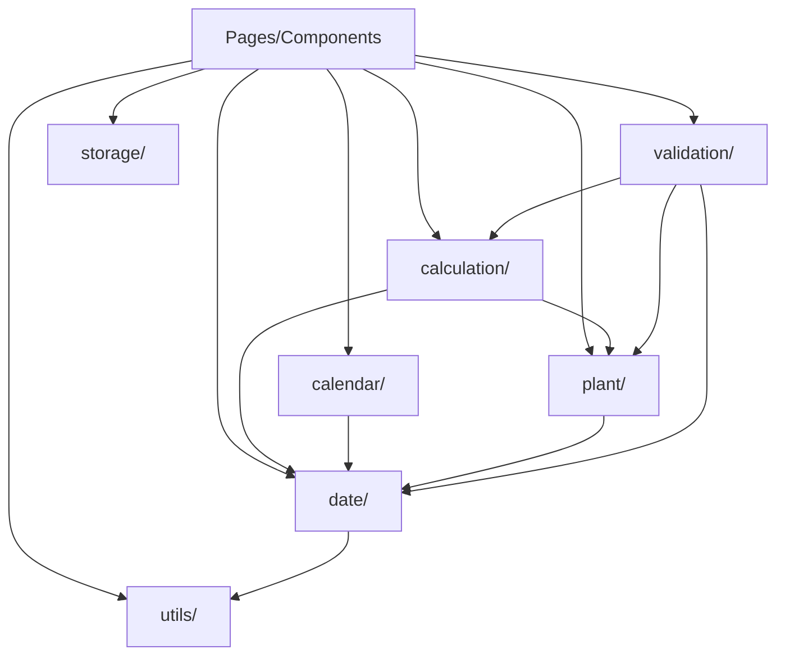
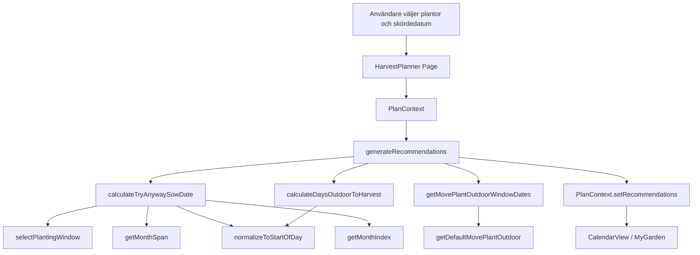
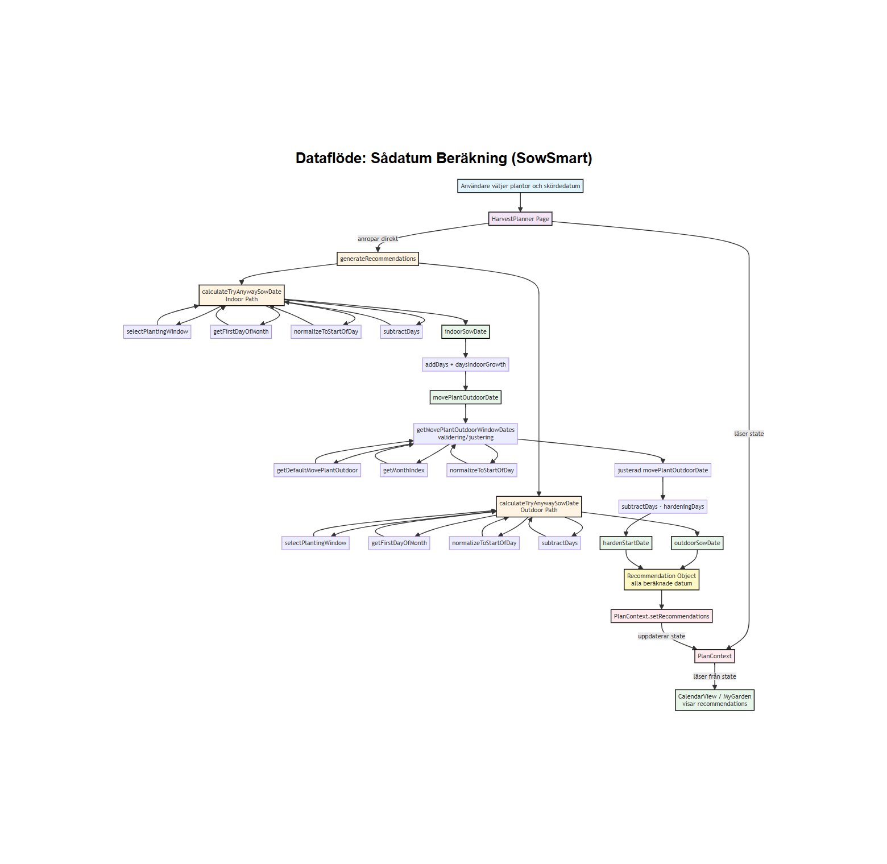

# Helpers Documentation

## Översikt

Helpers-mappen innehåller all affärslogik och utility-funktioner för SowSmart-applikationen. Funktionerna är organiserade i kategorier baserat på deras syfte och domän.

## Organisationsstruktur

```
src/helpers/
  calculation/   - Beräkningslogik (sådatum, rekommendationer, dagar)
  date/          - Datumhantering och formatering
  calendar/      - Kalender-relaterade funktioner
  plant/         - Plant-relaterad logik (validering, standardvärden, fönster)
  utils/         - Generiska utility-funktioner (text, sortering, bilder)
  validation/    - Validering och varningar
  storage/       - localStorage-hantering
```

## Naming Conventions

- **Filer**: camelCase (t.ex. `sowDate.ts`, `dateValidation.ts`)
- **Funktioner**: camelCase med beskrivande namn (t.ex. `calculateSowDate`, `formatDateSwedish`)
- **Exporterade konstanter**: UPPER_SNAKE_CASE (t.ex. `CALENDAR_EVENT_CONFIG`)

## Beroenden

Beroendegrafen visar vilka helper-kategorier som är beroende av varandra. Pilar visar import-beroenden: om kategori A använder funktioner från kategori B, pekar en pil från A till B.

**Legend för noderna i diagrammet:**

- **A** = Pages/Components - Alla sidor och komponenter som använder helpers
- **B** = calculation/ - Beräkningslogik för sådatum, rekommendationer och dagar
- **C** = date/ - Grundläggande datumfunktioner för formatering, parsing och manipulation
- **D** = calendar/ - Kalender-relaterade funktioner för events och tasks
- **E** = plant/ - Plant-relaterad logik för validering, standardvärden och fönster
- **F** = utils/ - Generiska utility-funktioner (text, sortering, bilder)
- **G** = validation/ - Validering och varningar för rekommendationer
- **H** = storage/ - localStorage-hantering för att spara och ladda plan

**Förklaring av beroenden:**

- **Pages/Components (A)** använder alla helper-kategorier
- **calculation/ (B)** är beroende av `date/` (C) och `plant/` (E)
- **date/ (C)** använder `utils/` (F) för vissa funktioner
- **calendar/ (D)** är beroende av `date/` (C)
- **plant/ (E)** är beroende av `date/` (C)
- **validation/ (G)** är beroende av `date/` (C), `calculation/` (B) och `plant/` (E)
- **storage/ (H)** har inga beroenden (endast typer)

**Viktiga mönster:**
- `date/` (C) är grundläggande och används av många kategorier
- `calculation/` (B) och `validation/` (G) har flest beroenden
- `utils/` (F), `calendar/` (D) och `storage/` (H) har få eller inga beroenden




## Per-kategori Dokumentation

### calculation/

Beräkningslogik för sådatum, rekommendationer och dagar.

#### `daysOutdoorToHarvest.ts`

**Syfte**: Beräknar antal dagar en planta kommer vara utomhus innan skörd.

**Beroenden**:
- `date/date.ts` - `addDays`, `normalizeToStartOfDay`

**Används av**:
- `calculation/recommendations.ts` - För att beräkna rekommendationer för inomhus-plantor

**Exempel**:
```typescript
const days = calculateDaysOutdoorToHarvest(sowDate, harvestDate, 60, 7);
// Returns: 91 (antal dagar utomhus innan skörd)
```

#### `recommendations.ts`

**Syfte**: Genererar kompletta planteringsrekommendationer baserat på valda plantor och skördedatum.

**Beroenden**:
- `date/date.ts` - `formatDateIso`, `parseDateIso`, `subtractDays`, `addDays`, `normalizeToStartOfDay`
- `date/dateValidation.ts` - `getMovePlantOutdoorWindowDates`
- `calculation/sowDate.ts` - `calculateTryAnywaySowDate`
- `calculation/daysOutdoorToHarvest.ts` - `calculateDaysOutdoorToHarvest`
- `plant/plantDefaults.ts` - `DEFAULT_DAYS_INDOOR_GROWTH_BY_SUBCATEGORY`, `DEFAULT_HARDENING_DAYS_BY_SUBCATEGORY`

**Används av**:
- `pages/HarvestPlanner.tsx` - För att generera rekommendationer när användaren väljer skördedatum
- `context/PlanContext.tsx` - Via `setRecommendations` action

**Exempel**:
```typescript
const recommendations = generateRecommendations(selectedPlants, "2026-08-01");
// Returns: Array of Recommendation objects with calculated dates
```

#### `sowDate.ts`

**Syfte**: Beräknar optimalt sådatum baserat på önskat skördedatum.

**Beroenden**:
- `date/date.ts` - `addDays`, `subtractDays`, `normalizeToStartOfDay`, `getMonthIndex`
- `date/monthSpan.ts` - `getMonthSpan`
- `plant/plantingWindow.ts` - `selectPlantingWindow`

**Används av**:
- `calculation/recommendations.ts` - För att beräkna sådatum i rekommendationer
- `date/dateValidation.ts` - För att beräkna "try anyway" sådatum

**Exempel**:
```typescript
const sowDate = calculateSowDate(harvestDate, plantingWindows, harvestTime, "indoor");
// Returns: Date object for optimal sow date
```

#### `totalDaysFromSeed.ts`

**Syfte**: Beräknar totala antalet dagar från sådd till skörd.

**Beroenden**:
- `date/monthSpan.ts` - `getMonthSpan`
- `plant/plantingWindow.ts` - `selectPlantingWindow`

**Används av**:
- `plant/validation.ts` - För att beräkna `totalDaysFromSeed` vid normalisering av plantdata

**Exempel**:
```typescript
const totalDays = calculateTotalDaysFromSeed(plantingWindows, harvestTime, "indoor");
// Returns: 273 (antal dagar från första dagen i såfönstret till sista dagen i skördefönstret)
```

### date/

Datumhantering, formatering och validering.

#### `date.ts`

**Syfte**: Grundläggande datumfunktioner för formatering, parsing och manipulation.

**Beroenden**: Inga (grundläggande funktioner)

**Används av**: Alla andra helper-kategorier och många komponenter

**Exporterade funktioner**:
- `formatDateIso(date: Date): string` - Formaterar datum till ISO-format (YYYY-MM-DD)
- `parseDateIso(iso: string): Date` - Parsar ISO-sträng till Date-objekt
- `formatDateSwedish(dateIso: string): string` - Formaterar till svenskt format (t.ex. "15 mars 2026")
- `formatDateSwedishWithoutYear(dateIso: string): string` - Formaterar utan år (t.ex. "5 mars")
- `formatMonthYearSwedish(date: Date): string` - Formaterar månad och år (t.ex. "mars 2026")
- `addDays(date: Date, days: number): Date` - Lägger till dagar till ett datum
- `subtractDays(date: Date, days: number): Date` - Subtraherar dagar från ett datum
- `normalizeToStartOfDay(date: Date): Date` - Normaliserar datum till starten av dagen (00:00:00)
- `getMonthIndex(monthName: string): number | null` - Konverterar svenskt månadsnamn till månadsindex (0-11)

**Exempel**:
```typescript
const iso = formatDateIso(new Date(2026, 2, 15)); // "2026-03-15"
const date = parseDateIso("2026-03-15");
const swedish = formatDateSwedish("2026-03-15"); // "15 mars 2026"
const monthIndex = getMonthIndex("mars"); // 2
```

#### `dateValidation.ts`

**Syfte**: Validering av skördedatum och beräkning av fönster för planting/harvest.

**Beroenden**:
- `date/date.ts` - `formatDateIso`, `formatDateSwedish`, `parseDateIso`, `normalizeToStartOfDay`, `getMonthIndex`
- `calculation/sowDate.ts` - `calculateSowDate`, `calculateTryAnywaySowDate`
- `plant/plantingWindow.ts` - `selectPlantingWindow`
- `plant/plantDefaults.ts` - `getDefaultMovePlantOutdoor`

**Används av**:
- `pages/HarvestPlanner.tsx` - För validering av skördedatum
- `calculation/recommendations.ts` - För att få movePlantOutdoor-fönster
- `helpers/date/plantMessages.ts` - För att beräkna plantmeddelanden

**Exporterade funktioner**:
- `getHarvestWindowDates(harvestTime, year)` - Hämtar skördefönster som Date-objekt
- `getPlantingWindowDates(plant, year)` - Hämtar såfönster som Date-objekt
- `getMovePlantOutdoorWindowDates(plant, year)` - Hämtar utplanteringsfönster som Date-objekt
- `validateHarvestDate(harvestDateIso, now)` - Validerar skördedatum
- `getPlantSowResult(harvestDateIso, plant, now)` - Beräknar såresultat med meddelanden

**Exempel**:
```typescript
const isValid = validateHarvestDate("2026-08-01", new Date());
const result = getPlantSowResult("2026-08-01", plant);
// Returns: { key: "harvestDate", message: "...", sowDateIso: "2026-03-15" }
```

#### `monthSpan.ts`

**Syfte**: Beräknar antal dagar mellan två månader.

**Beroenden**:
- `date/monthToDays.ts` - `getDaysInMonth`

**Används av**:
- `calculation/totalDaysFromSeed.ts` - För att beräkna totala dagar
- `calculation/sowDate.ts` - För att beräkna spans i sådatum-beräkningar

**Exempel**:
```typescript
const span = getMonthSpan("feb", "april"); // Returns: 89 (1 feb till 30 april)
```

#### `monthToDays.ts`

**Syfte**: Konverterar månadsnamn till antal dagar i månaden.

**Beroenden**: Inga

**Används av**:
- `date/monthSpan.ts` - För att beräkna spans

**Exempel**:
```typescript
const days = getDaysInMonth("feb"); // Returns: 28
```

#### `plantMessages.ts`

**Syfte**: Beräknar plantmeddelanden från rekommendationer eller skördedatum.

**Beroenden**:
- `date/date.ts` - `formatDateIso`, `parseDateIso`
- `date/dateValidation.ts` - `getPlantSowResult`
- `calculation/sowDate.ts` - `calculateTryAnywaySowDate`

**Används av**:
- `components/shared/SelectedPlantsList/SelectedPlantsList.tsx` - För att visa meddelanden
- `components/myGarden/MyGardenSelectedPlants/MyGardenSelectedPlants.tsx` - För att visa meddelanden

**Exempel**:
```typescript
const messages = calculatePlantMessagesFromRecommendations(recommendations, plants);
// Returns: Map<plantId, PlantSowResult>
```

### calendar/

Kalender-relaterade funktioner för att visa events och tasks.

#### `calendar.ts`

**Syfte**: Bygger kalendergrid och hanterar månadsnavigation.

**Beroenden**: Inga

**Används av**:
- `components/calendar/CalendarMonth/CalendarMonth.tsx` - För att bygga kalendergrid
- `components/calendar/CalendarDay/CalendarDay.tsx` - För att kontrollera om datum är samma dag/idag

**Exporterade funktioner**:
- `getDaysInMonth(year, month)` - Hämtar antal dagar i en månad
- `getFirstDayOfMonth(year, month)` - Hämtar veckodag för första dagen i månaden
- `getCalendarDays(year, month)` - Hämtar alla dagar som ska visas i kalendergriden
- `isSameDay(date1, date2)` - Kontrollerar om två datum är samma dag
- `isToday(date)` - Kontrollerar om ett datum är idag

**Exempel**:
```typescript
const days = getCalendarDays(2026, 2); // Returns: Array of Date objects for March 2026 grid
```

#### `events.ts`

**Syfte**: Konverterar rekommendationer till kalenderevents.

**Beroenden**: Inga (använder bara typer)

**Används av**:
- `components/calendar/CalendarDay/CalendarDay.tsx` - För att visa events
- `components/calendar/CalendarMonth/CalendarMonth.tsx` - För att visa events
- `components/event/EventIcon/EventIcon.tsx` - För event-ikoner
- `components/event/EventIconInteractive/EventIconInteractive.tsx` - För interaktiva ikoner
- `components/event/EventInfoModal/EventInfoModal.tsx` - För event-info i modal

**Exporterade funktioner/typer**:
- `CalendarEventType` - Typ för event-typer
- `CalendarEvent` - Typ för event-objekt
- `CALENDAR_EVENT_CONFIG` - Konfiguration för event-typer (labels, tooltips, modal content)
- `CALENDAR_ICON_SIZES` - Ikonstorlekar
- `ALL_CALENDAR_EVENT_TYPES` - Array med alla event-typer
- `recommendationsToEvents(recommendations, plants)` - Konverterar rekommendationer till events

**Exempel**:
```typescript
const events = recommendationsToEvents(recommendations, plants);
// Returns: Array of CalendarEvent objects
```

#### `tasks.ts`

**Syfte**: Konverterar rekommendationer till tasks för "Min odlingsplan".

**Beroenden**:
- `date/date.ts` - `formatDateSwedish`, `parseDateIso`
- `calendar/events.ts` - `CALENDAR_EVENT_CONFIG`

**Används av**:
- `components/myGarden/MyGardenTaskList/MyGardenTaskList.tsx` - För att visa tasks
- `pages/MyGarden.tsx` - För att visa tasks

**Exporterade funktioner**:
- `recommendationsToTasks(recommendations, plants)` - Konverterar rekommendationer till tasks, sorterade kronologiskt
- `getTaskTypeLabel(type)` - Hämtar label för task-typ
- `taskTypeToDateType(taskType)` - Mappar task-typ till dateType för varningar

**Exempel**:
```typescript
const tasks = recommendationsToTasks(recommendations, plants);
// Returns: Array of Task objects, sorted by date
```

### plant/

Plant-relaterad logik för validering, standardvärden och fönster.

#### `germination.ts`

**Syfte**: Parsar groningstid från strängformat.

**Beroenden**: Inga

**Används av**:
- `plant/validation.ts` - Vid normalisering av plantdata

**Exempel**:
```typescript
const days = parseGerminationTime("5-15 dagar"); // Returns: 10 (average)
const days = parseGerminationTime("10 dagar"); // Returns: 10
```

#### `plantDefaults.ts`

**Syfte**: Standardvärden för plantdata baserat på subcategory.

**Beroenden**: Inga (endast typer)

**Används av**:
- `plant/validation.ts` - Vid normalisering när plantdata saknas
- `date/dateValidation.ts` - För att få movePlantOutdoor-standardvärden

**Exporterade konstanter**:
- `DEFAULT_PLANTING_METHOD_BY_SUBCATEGORY` - Standard planting method per subcategory
- `DEFAULT_HARDENING_DAYS_BY_SUBCATEGORY` - Standard hardening days per subcategory
- `DEFAULT_FROST_TOLERANT_BY_SUBCATEGORY` - Standard frost tolerance per subcategory
- `DEFAULT_GERMINATION_TIME_BY_SUBCATEGORY` - Standard germination time per subcategory
- `DEFAULT_GERMINATION_TEMPERATURE_BY_SUBCATEGORY` - Standard germination temperature per subcategory
- `DEFAULT_GROWING_TEMPERATURE_BY_SUBCATEGORY` - Standard growing temperature per subcategory
- `DEFAULT_DAYS_INDOOR_GROWTH_BY_SUBCATEGORY` - Standard days indoor growth per subcategory

**Exporterade funktioner**:
- `getDefaultMovePlantOutdoor(subcategory, frostTolerant)` - Hämtar standard movePlantOutdoor-konfiguration

**Exempel**:
```typescript
const movePlantOutdoor = getDefaultMovePlantOutdoor("tomat", false);
// Returns: { description: "efter avhärdning när frostrisken är över", start: "maj", end: "juni" }
```

#### `plantingWindow.ts`

**Syfte**: Väljer och validerar planting windows.

**Beroenden**: Inga (endast typer)

**Används av**:
- `calculation/sowDate.ts` - För att välja rätt planting window
- `calculation/totalDaysFromSeed.ts` - För att välja rätt planting window
- `date/dateValidation.ts` - För att få planting window dates

**Exempel**:
```typescript
const window = selectPlantingWindow(plantingWindows, "indoor");
// Returns: { start: "mars", end: "april" } or null
```

#### `validation.ts`

**Syfte**: Normaliserar och validerar plantdata från plants.json.

**Beroenden**:
- `plant/plantDefaults.ts` - Alla DEFAULT-konstanter och `getDefaultMovePlantOutdoor`
- `plant/germination.ts` - `parseGerminationTime`
- `calculation/totalDaysFromSeed.ts` - `calculateTotalDaysFromSeed`

**Används av**:
- `services/plantsService.ts` - För att normalisera plantdata när den laddas från JSON

**Exporterade funktioner**:
- `normalizePlant(raw: RawPlant): Plant` - Normaliserar RawPlant till Plant med standardvärden
- `toNullableNumber(value)` - Parsar värde till nullable number
- `isPlantingMethod(value)` - Type guard för PlantingMethod

**Exempel**:
```typescript
const normalized = normalizePlant(rawPlant);
// Returns: Plant object with all defaults applied
```

### utils/

Generiska utility-funktioner som används av flera kategorier.

#### `image.ts`

**Syfte**: Hantering av bilder och fallback.

**Beroenden**: Inga

**Används av**:
- `components/plantSelection/PlantsCard/PlantsCard.tsx` - För att hantera trasiga bilder
- `components/modal/ModalPlantDetailsCard/ModalPlantDetailsCard.tsx` - För att hantera trasiga bilder

**Exporterade funktioner**:
- `handleImageError(event, fallbackSrc)` - Hanterar trasiga bilder genom att byta till fallback

**Exempel**:
```typescript
 handleImageError(e, FALLBACK_PLANT_IMAGE_SRC)} />
```

#### `sorting.ts`

**Syfte**: Sorteringsfunktioner för plantor och subcategories.

**Beroenden**:
- `models/Plant.ts` - `Plant` typ

**Används av**:
- `components/shared/FilterDropdown/FilterDropdown.tsx` - För att sortera filter-options
- `components/plantSelection/PlantsList/PlantsList.tsx` - För att sortera plantor
- `components/plantSelection/PlantsCategoryButtons/PlantsCategoryButtons.tsx` - För att sortera kategorier

**Exporterade funktioner**:
- `sortPlantsBySubcategoryAndName(plants)` - Sorterar plantor först på subcategory, sedan på namn
- `sortSubcategories(subcategories)` - Sorterar subcategories alfabetiskt med "Övrigt" sist

**Exempel**:
```typescript
const sorted = sortPlantsBySubcategoryAndName(plants);
const sortedSubcats = sortSubcategories(["Tomat", "Övrigt", "Gurka"]);
// Returns: ["Gurka", "Tomat", "Övrigt"]
```

#### `text.ts`

**Syfte**: Textmanipuleringsfunktioner.

**Beroenden**: Inga

**Används av**: Många komponenter för att formatera text

**Exporterade funktioner**:
- `capitalizeFirst(str)` - Gör första bokstaven stor

**Exempel**:
```typescript
const capitalized = capitalizeFirst("tomat"); // "Tomat"
```

### validation/

Validering och varningar för rekommendationer.

#### `warnings.ts`

**Syfte**: Genererar varningar för rekommendationer som ligger utanför optimala fönster.

**Beroenden**:
- `date/date.ts` - `parseDateIso`, `subtractDays`, `normalizeToStartOfDay`
- `date/dateValidation.ts` - `getHarvestWindowDates`, `getPlantingWindowDates`, `getMovePlantOutdoorWindowDates`

**Används av**:
- `components/myGarden/MyGardenTaskList/MyGardenTaskList.tsx` - För att visa varningar på tasks
- `pages/MyGarden.tsx` - För att visa varningar

**Exporterade funktioner**:
- `getPlantWarnings(recommendation, plant)` - Hämtar varningar för en rekommendation

**Exempel**:
```typescript
const warnings = getPlantWarnings(recommendation, plant);
// Returns: Array of PlantWarning objects
```

### storage/

localStorage-hantering för att spara och ladda plan.

#### `localStorage.ts`

**Syfte**: Hanterar sparning och laddning av plan till/från localStorage.

**Beroenden**: Inga (endast typer)

**Används av**:
- `context/PlanContext.tsx` - För att spara/ladda plan vid state-ändringar
- `reducers/planReducer.ts` - För att rensa localStorage vid reset

**Exporterade funktioner**:
- `savePlanToLocalStorage(plan)` - Sparar plan till localStorage
- `loadPlanFromLocalStorage()` - Laddar plan från localStorage
- `clearPlanFromLocalStorage()` - Rensar plan från localStorage
- `saveHarvestDatesByFilterToLocalStorage(harvestDatesByFilter)` - Sparar harvest dates per filter
- `loadHarvestDatesByFilterFromLocalStorage()` - Laddar harvest dates per filter

**Exempel**:
```typescript
savePlanToLocalStorage(planState);
const saved = loadPlanFromLocalStorage();
```

## Dataflöde - Sådatum Beräkning

Följande diagram visar hur ett sådatum beräknas från användarens input:



## ASCII
┌─────────────────────────────────────┐
│ Användare väljer plantor och        │
│ skördedatum                         │
└──────────────┬──────────────────────┘
               │
               ▼
┌─────────────────────────────────────┐
│      HarvestPlanner Page            │
└───┬─────────────────────────────┬───┘
    │                             │
    │ (läser state)               │ (anropar direkt)
    ▼                             ▼
┌──────────────┐        ┌──────────────────────────┐
│ PlanContext  │        │ generateRecommendations  │
│ (State Mgmt) │        └───────────┬──────────────┘
└──────────────┘                    │
                                    │
                    ┌───────────────┴────────────────┐
                    │                                │
                    ▼                                ▼
         ┌───────────────────────┐        ┌───────────────────────┐
         │ Outdoor Path          │        │ Indoor Path           │
         │                       │        │                       │
         │ calculateTryAnyway    │        │ calculateTryAnyway    │
         │ SowDate               │        │ SowDate               │
         │                       │        │                       │
         │ [Helpers:]            │        │ [Helpers:]            │
         │ - selectPlantingWin   │        │ - selectPlantingWin   │
         │ - getFirstDayOfMonth  │        │ - getFirstDayOfMonth  │
         │ - normalizeToStart    │        │ - normalizeToStart    │
         │ - subtractDays        │        │ - subtractDays        │
         └───────────┬───────────┘        └───────────┬───────────┘
                     │                                │
                     ▼                                ▼
         ┌──────────────────────┐        ┌──────────────────────┐
         │ outdoorSowDate       │        │ indoorSowDate        │
         └───────────┬──────────┘        └───────────┬──────────┘
                     │                               │
                     │                               ▼
                     │                     ┌──────────────────────┐
                     │                     │ addDays +            │
                     │                     │ daysIndoorGrowth     │
                     │                     └──────────┬───────────┘
                     │                                │
                     │                                ▼
                     │                     ┌──────────────────────┐
                     │                     │ movePlantOutdoorDate │
                     │                     └──────────┬───────────┘
                     │                                │
                     │                                ▼
                     │                     ┌──────────────────────┐
                     │                     │ getMovePlantOutdoor  │
                     │                     │ WindowDates          │
                     │                     │ (validering)         │
                     │                     │ [getDefaultMove...]  │
                     │                     └──────────┬───────────┘
                     │                                │
                     │                                ▼
                     │                     ┌───────────────────────┐
                     │                     │ subtractDays -        │
                     │                     │ hardeningDays         │
                     │                     └───────────┬───────────┘
                     │                                 │
                     │                                 ▼
                     │                     ┌──────────────────────┐
                     │                     │ hardenStartDate      │
                     │                     └──────────┬───────────┘
                     │                                │
                     └──────────────────┬─────────────┘
                                        │
                                        ▼
                         ┌──────────────────────────────┐
                         │ Recommendation Object        │
                         │ (alla beräknade datum)       │
                         └──────────────┬───────────────┘
                                        │
                                        ▼
                         ┌───────────────────────────────┐
                         │ PlanContext.setRecommendations│
                         └──────────────┬────────────────┘
                                        │
                                        ▼
                         ┌──────────────────────────────┐
                         │ PlanContext (uppdaterar)     │
                         └──────────────┬───────────────┘
                                        │
                                        ▼
                         ┌──────────────────────────────┐
                         │ CalendarView / MyGarden      │
                         │ (visar recommendations)      │
                         └──────────────────────────────┘

### Visuellt Diagram



**Förklaring av flödet i diagrammet ovan:**

1. **Användare → HarvestPlanner**: Användaren väljer plantor och skördedatum i HarvestPlanner-sidan
2. **HarvestPlanner → PlanContext**: HarvestPlanner använder PlanContext för att hantera state
3. **PlanContext → generateRecommendations**: PlanContext triggar `generateRecommendations` när skördedatum sätts
4. **generateRecommendations → calculateTryAnywaySowDate**: `generateRecommendations` anropar `calculateTryAnywaySowDate` för varje planta (både inomhus och utomhus)
5. **calculateTryAnywaySowDate → helpers**: `calculateTryAnywaySowDate` använder flera helper-funktioner (`selectPlantingWindow`, `getMonthSpan`, `normalizeToStartOfDay`, `getMonthIndex`) för beräkningen
6. **generateRecommendations → calculateDaysOutdoorToHarvest**: För inomhus-plantor beräknas även `calculateDaysOutdoorToHarvest`
7. **generateRecommendations → getMovePlantOutdoorWindowDates**: För inomhus-plantor hämtas utplanteringsfönster med standardvärden via `getDefaultMovePlantOutdoor`
8. **generateRecommendations → PlanContext**: Rekommendationerna sparas i PlanContext via `setRecommendations`
9. **PlanContext → CalendarView/MyGarden**: CalendarView och MyGarden visar de beräknade rekommendationerna


## Beroendekedjor

### Långa kedjor

1. **recommendations.ts** → sowDate.ts → date.ts → monthSpan.ts → monthToDays.ts
2. **warnings.ts** → dateValidation.ts → date.ts → plantDefaults.ts
3. **dateValidation.ts** → sowDate.ts → date.ts → plantingWindow.ts

### Korta kedjor

1. **calendar.ts** - Inga beroenden (grundläggande datumfunktioner)
2. **utils/** - Inga beroenden (generiska funktioner)
3. **storage/** - Inga beroenden (endast typer)

## Användningsområden

### Pages som använder helpers

- **HarvestPlanner.tsx**: `calculation/recommendations`, `date/dateValidation`
- **CalendarView.tsx**: `calendar/calendar`, `calendar/events`
- **MyGarden.tsx**: `calendar/tasks`, `validation/warnings`
- **PlantSelection.tsx**: `utils/sorting`, `utils/text`

### Components som använder helpers

- **CalendarDay/CalendarMonth**: `calendar/calendar`, `calendar/events`, `date/date`
- **MyGardenTaskList**: `calendar/tasks`, `validation/warnings`, `date/date`
- **SelectedPlantsList**: `date/date`, `date/plantMessages`
- **FilterDropdown**: `utils/sorting`
- **PlantsCard**: `utils/text`, `utils/image`

## Best Practices

1. **Använd centraliserade funktioner**: Använd `normalizeToStartOfDay` istället för `setHours(0,0,0,0)` direkt
2. **Använd typer**: Alla helpers använder TypeScript-typer från `models/`
3. **Säkra fallbacks**: Alla funktioner returnerar `null` eller tomma arrays vid fel, kastar inte exceptions
4. **JSDoc**: Alla exporterade funktioner har JSDoc-kommentarer med parametrar, returvärden och exempel

## Ytterligare Resurser

- Se `.cursor/plans/sowdate_calculation_flow.md` för detaljerad beskrivning av sådatum-beräkning
- Se JSDoc-kommentarer i varje fil för detaljerad dokumentation av funktioner

